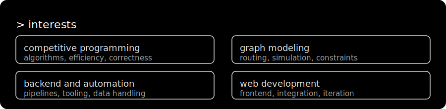
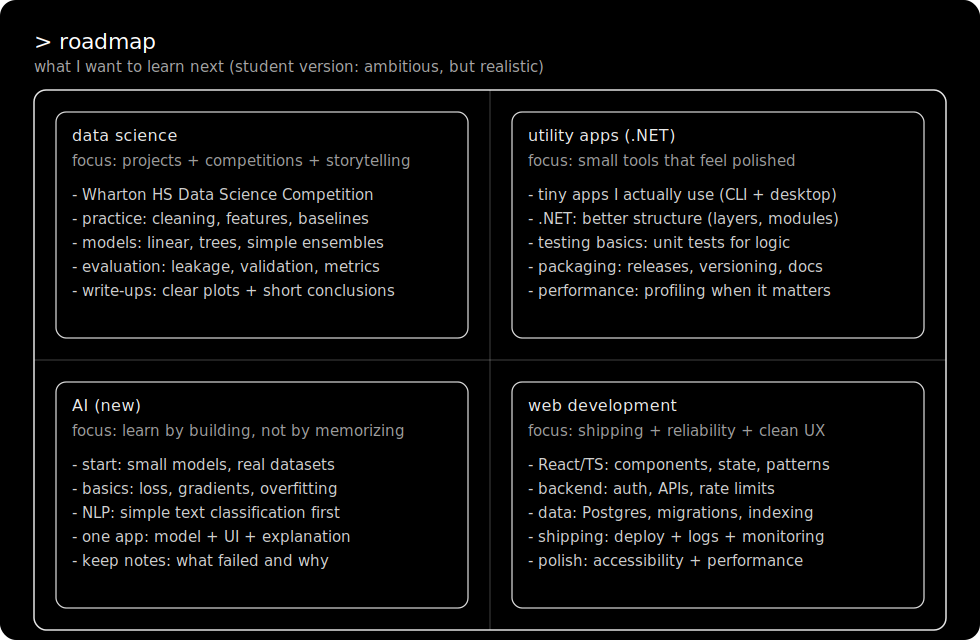

  

High School Student '27

  
  

---

## Overview

  

  

---

## Contribution Activity

  

---

  

---
## Tech Stack

  

---
## Tools

  

---

  

---

## Selected Projects

  
  

  
  

  

<table>
  <tr>
    <td width="50%" valign="top">